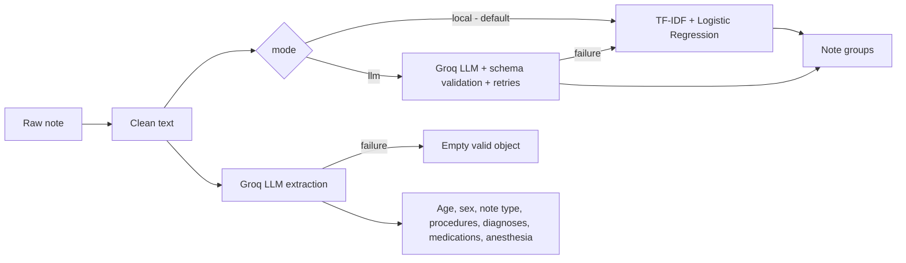

# 🩺 Clinical Note Intelligence

**Label clustering, a clinical-text classifier and LLM structured extraction on the MTSamples medical transcriptions, served through a FastAPI API.**

    

> ⚠️ Built on the public, de-identified [MTSamples](https://www.kaggle.com/datasets/tboyle10/medicaltranscriptions) dataset for educational purposes. **Not a medical device and not for clinical use.**

---

## Overview

The MTSamples dataset has 4,999 transcriptions filed under 40 medical specialties. Exploring it showed two problems that shape the whole project:

- **The same note is filed under several labels.** Only 2,357 of the 4,966 non-empty rows are unique texts, and **91% of unique notes carry 2+ labels** (2.11 on average). Treating each row as a single-label example leaks duplicates between train and test and caps accuracy.
- **Many labels are tiny or are document types** (`Letters`, `Discharge Summary`, `SOAP / Chart / Progress Notes`) rather than specialties.

So the project works on **unique notes with multi-label targets**, groups the 40 labels into **11 clinically meaningful groups**, trains a classifier, and wraps an LLM layer around it for structured extraction. The notebook documents the whole journey; the `app/` package serves the result.

## Pipeline



## Results

Evaluated on **354 held-out unique notes** (train 1,649 / val 354 / test 354), threshold 0.35 tuned on validation:

| Model | hit@1 | hit@3 | micro-F1 | macro-F1 |
|---|---|---|---|---|
| **TF-IDF + Logistic Regression** (deployed) | **0.966** | 1.000 | **0.896** | **0.855** |

On a shared 100-note sample, the baseline also beat the LLM:

| Model | hit@1 | micro-F1 | macro-F1 |
|---|---|---|---|
| TF-IDF + Logistic Regression | 0.98 | 0.917 | 0.876 |
| Groq `openai/gpt-oss-120b` (async) | 0.96 | 0.885 | 0.819 |
| Groq `openai/gpt-oss-120b` (sequential) | 0.95 | 0.818 | 0.736 |

Key takeaways:

- Clinical dictations are template-like, so a TF-IDF baseline is very hard to beat. **That is why the API defaults to the local model for classification** and uses the LLM only where it adds something the local model cannot do: structured extraction.
- Async batching was **3.5x faster** than sequential LLM calls (264 s vs 934 s for 100 notes), but 53 of 100 async calls hit the fallback under rate limiting, which is exactly what the fallback layer is for.
- Weakest group: `Oncology & Pathology` (F1 0.67, only 15 test notes). Strongest: `Surgery (Operative Notes)` (F1 0.97).
- The `Bio_ClinicalBERT` fine-tuning section is implemented in the notebook but was **skipped** (no GPU in the run). Run it on a GPU runtime to compare.

## The 11 note groups

| Group | Source labels |
|---|---|
| Surgery (Operative Notes) | Surgery, Cosmetic / Plastic Surgery |
| General Clinical Notes | Consult - H&P, General Medicine, SOAP/Progress Notes, Office Notes, Discharge Summary, ER Reports, Letters, IME-QME |
| Musculoskeletal & Rehab | Orthopedic, Podiatry, Chiropractic, Physical Medicine, Rheumatology, Pain Management |
| Cardiopulmonary & Sleep | Cardiovascular / Pulmonary, Sleep Medicine |
| Neurology & Mental Health | Neurology, Neurosurgery, Psychiatry, Speech-Language |
| Digestive & Metabolic | Gastroenterology, Endocrinology, Bariatrics, Diets and Nutritions |
| Genitourinary & Renal | Urology, Nephrology |
| Women's & Children's Health | Obstetrics / Gynecology, Pediatrics - Neonatal |
| Head, Eye, Ear, Skin & Dental | ENT, Ophthalmology, Dentistry, Dermatology, Allergy / Immunology |
| Oncology & Pathology | Hematology - Oncology, Lab Medicine, Autopsy, Hospice |
| Radiology | Radiology |

The grouping is knowledge-guided and then validated with the data: Ward clustering of label text profiles, and a permutation test (2,000 random groupings) where the curated groups are far more cohesive than chance (observed similarity 0.089 vs 0.042 for the 99.9th percentile of random groupings).

## Reliability features (LLM layer)

- **Schema validation** with Pydantic: groups must come from the 11 allowed values (casing/punctuation is normalised, invented groups are rejected, at most 3 groups, confidence in [0, 1]).
- **Retries** with exponential backoff (3 attempts) on API, JSON and schema failures.
- **Fallback** to the local model for classification and to an empty-but-valid object for extraction.
- **Prompt-injection hardening**: notes are treated as data only; output is schema-checked.
- **Input guardrails** in the API: empty / non-text / oversized notes are rejected.
- **Async + semaphore** to bound concurrency against rate limits.

## Project structure

```
clinical-note-intelligence/
├── app/
│   ├── main.py          # FastAPI routes
│   ├── pipeline.py      # classify / extract orchestration with fallbacks
│   ├── local_model.py   # TF-IDF + LogReg inference
│   ├── llm.py           # async Groq client, retries, validation
│   ├── prompts.py       # system, few-shot, classification and extraction prompts
│   ├── schemas.py       # Pydantic models (LLM output + API)
│   ├── constants.py     # 40 labels -> 11 groups, class order, threshold
│   ├── text.py          # note cleaning
│   └── config.py        # environment settings
├── models/              # trained .joblib files (vectorizer + classifier)
├── notebooks/clinical_notes_pipeline.ipynb
├── tests/test_api.py
├── Dockerfile
├── requirements.txt
└── .env.example
```

## Quick start

```bash
git clone https://github.com/abdodedo20005-hash/clinical-note-intelligence.git
cd clinical-note-intelligence
python -m venv .venv && source .venv/bin/activate     # Windows: .venv\Scripts\activate
pip install -r requirements.txt

cp .env.example .env        # optional: add GROQ_API_KEY to enable LLM features
uvicorn app.main:app --reload
```

Open **http://localhost:8000/docs** for the interactive Swagger UI.

> The models were pickled with scikit-learn **1.6.1**, so `requirements.txt` pins that exact version.

### Docker

```bash
docker build -t clinical-note-intelligence .
docker run -p 8000:8000 --env-file .env clinical-note-intelligence
```

## API

| Method | Endpoint | Description |
|---|---|---|
| GET | `/health` | Service status, whether the LLM is enabled |
| POST | `/classify?mode=local\|llm\|auto` | Classify one note into note groups |
| POST | `/classify/batch` | Classify up to 50 notes (vectorised for `local`, async for `llm`) |
| POST | `/extract` | Structured extraction (needs `GROQ_API_KEY`, else `503`) |
| POST | `/analyze` | Classification + extraction in one call |

**Classify**

```bash
curl -X POST http://localhost:8000/classify \
  -H "Content-Type: application/json" \
  -d '{"note": "PROCEDURE: Arthroscopic partial medial meniscectomy of the right knee under general anesthesia."}'
```

```json
{
  "groups": ["Musculoskeletal & Rehab", "Surgery (Operative Notes)"],
  "confidence": 0.5997,
  "source": "local",
  "scores": {"Musculoskeletal & Rehab": 0.5997, "Surgery (Operative Notes)": 0.4809, "Radiology": 0.1842, "...": 0.0}
}
```

`source` is `local`, `llm`, or `fallback` (LLM failed, local model answered).

**Analyze** (classification + extraction)

```bash
curl -X POST "http://localhost:8000/analyze" -H "Content-Type: application/json" \
  -d '{"note": "52-year-old male with erythema of the right knee. Knee joint aspiration performed under local anesthesia."}'
```

```json
{
  "classification": {"groups": ["Surgery (Operative Notes)", "Musculoskeletal & Rehab"], "confidence": 0.61, "source": "local"},
  "extraction": {
    "patient_age": 52, "patient_sex": "Male", "note_type": "Operative",
    "procedures": ["Knee joint aspiration"], "diagnoses": ["Erythema of the right knee"],
    "medications": [], "anesthesia_used": true
  },
  "extraction_used_fallback": false
}
```

(Example values are illustrative.)

**Python**

```python
import requests
r = requests.post("http://localhost:8000/classify", json={"note": "CT abdomen with contrast. IMPRESSION: no acute process."})
print(r.json()["groups"])
```

## Configuration

| Variable | Default | Purpose |
|---|---|---|
| `GROQ_API_KEY` | _(empty)_ | Enables `/extract`, `/analyze` extraction and `mode=llm` |
| `GROQ_MODEL` | `openai/gpt-oss-120b` | Groq model name |
| `LLM_CONCURRENCY` | `5` | Max simultaneous LLM calls |
| `NOTE_CHARS` | `3000` | Characters of each note sent to the LLM |

Never commit your `.env` file; it is already in `.gitignore`.

## Reproducing the notebook

1. Open `notebooks/clinical_notes_pipeline.ipynb` in Google Colab (a free T4 GPU enables the Bio_ClinicalBERT section).
2. The dataset downloads automatically from Kaggle via `kagglehub`.
3. Add `GROQ_API_KEY` as an environment variable or Colab secret to run the LLM sections; without it the notebook uses the local model only.
4. The last section saves `tfidf_vectorizer.joblib` and `tfidf_logistic_regression_classifier.joblib`, which are the files in `models/`.

## Tests

```bash
pip install -r requirements-dev.txt
pytest
```

The tests cover the local model, input guardrails, schema validation, batch limits, graceful degradation without an LLM key, and the LLM path plus fallback (using a fake LLM, so no network is needed).

## Limitations and next steps

- The dataset is small and templated; scores may not transfer to real hospital notes.
- `Oncology & Pathology` has few examples and the lowest F1.
- Fine-tuned Bio_ClinicalBERT is not part of the deployed service yet (needs a GPU run; its weights would be loaded the same way as the TF-IDF model).
- Possible additions: API authentication, rate limiting, request logging/metrics, CI with GitHub Actions, model versioning.

## Author

**Abdelrahman Osama Mekhemer** - Computer Science student, Tanta University
[LinkedIn](https://linkedin.com/in/abdelrahman-osama20005) · [GitHub](https://github.com/abdodedo20005-hash)

## License

MIT
